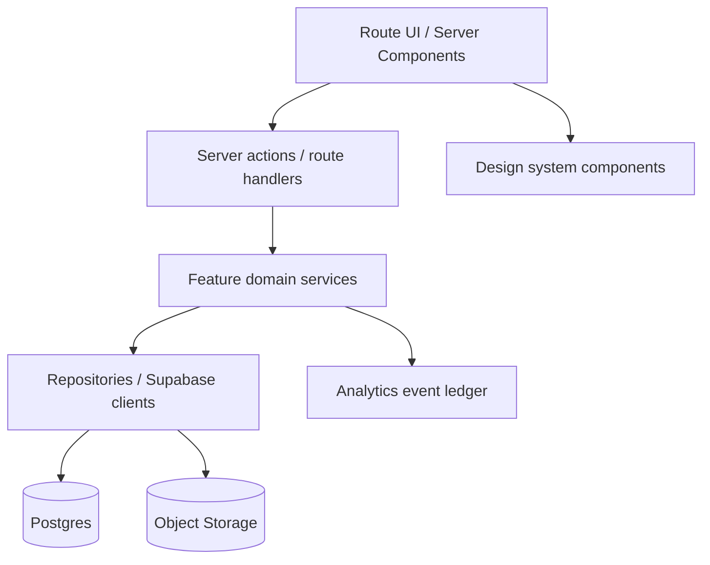
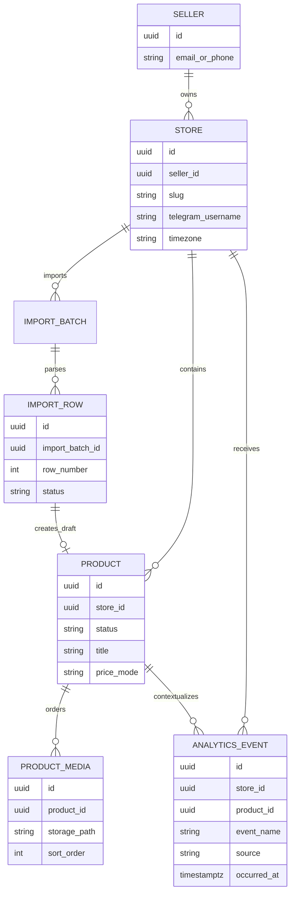
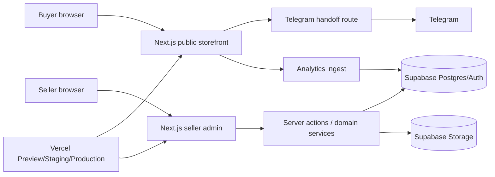

# Architecture Spine — Персональная витрина

## Design Paradigm

Vertical-slice modular monolith on Next.js App Router. Each product capability owns its UI route segments, server actions/queries, domain service, and tests. Shared code is allowed only for primitives, adapters, auth/session, analytics ingestion, and design-system components.



## Invariants & Rules

### AD-1 — Mobile-first responsive web, not native app

- **Binds:** FR-10..FR-22, UX Foundation
- **Prevents:** native/mobile-web teams solving the same flows with incompatible navigation, auth, and UI state.
- **Rule:** MVP ships as a responsive web app. Phone viewport 360–430px is the primary acceptance surface. Desktop may enhance layout but cannot introduce different capability semantics.

### AD-2 — Seller admin and public storefront are separate route/module surfaces

- **Binds:** FR-1..FR-4, FR-10..FR-13, FR-17..FR-20
- **Prevents:** seller-preview/admin behavior leaking into public analytics, auth, or visibility rules.
- **Rule:** Public storefront routes never require buyer auth and never import seller-admin-only UI/services. Seller preview must call public rendering paths with preview context, and preview analytics are excluded at ingest.

### AD-3 — Telegram is the only enabled MVP contact adapter

- **Binds:** FR-14..FR-16, UX Flow 2, PRD §15
- **Prevents:** builders adding WhatsApp/VK/alternative contacts as hidden MVP scope or modeling internal chat prematurely.
- **Rule:** Contact channel is modeled as an adapter interface, but the only valid MVP adapter value is `telegram`. WhatsApp, VK, multiple active messengers, and alternative contacts remain disabled `Could` scope.

### AD-4 — CTA click is recorded before external handoff

- **Binds:** FR-15, FR-16, FR-18, SM-3, SM-5
- **Prevents:** analytics depending on unobservable Telegram message-send or purchase outcomes.
- **Rule:** CTA click event is appended synchronously before generating/opening the Telegram handoff URL. The system records intent, not sent message or deal state.

### AD-5 — Product visibility is derived only from lifecycle state

- **Binds:** FR-5..FR-8, FR-10..FR-13
- **Prevents:** draft/hidden/deleted products appearing publicly through catalog, direct URL, preview, analytics, or Telegram message links.
- **Rule:** Public queries include only products with `status=published` and active store ownership. Draft, hidden, and deleted states are excluded at repository/query boundary, not filtered only in UI.

### AD-6 — Import creates drafts only

- **Binds:** FR-9, UJ-2, SM-7
- **Prevents:** imported rows bypassing seller review, photo requirements, or publication rules.
- **Rule:** Import writes product drafts with extraction metadata. It never creates published products and never skips product validation required for publication.

### AD-7 — Analytics is an append-only observed-event ledger

- **Binds:** FR-17..FR-20, Analytics event catalog, SM-3..SM-7
- **Prevents:** mutable counters becoming the source of truth or inferred outcomes being mixed with observed behavior.
- **Rule:** Store view, product view, and CTA click are appended as events with exclusion context. Dashboard summaries derive from events and may be cached/materialized, but raw events remain canonical.

### AD-8 — Source attribution is session-scoped with explicit-source precedence

- **Binds:** FR-19, FR-20, UJ-4, Analytics event catalog
- **Prevents:** product views/CTA clicks losing source context or referrer overriding seller-generated source labels.
- **Rule:** `source`/UTM label beats HTTP referrer; absent both, source is `unknown`. Source propagates from storefront to product detail and CTA click within the same anonymous session.

### AD-9 — Seller auth only; buyers remain anonymous

- **Binds:** FR-1, FR-10..FR-16, Non-Goals
- **Prevents:** accidental buyer accounts, chat identity, order identity, or support/dispute obligations entering MVP.
- **Rule:** Auth applies only to seller/admin routes. Public buyer sessions may use anonymous session IDs for analytics, but no buyer account or buyer profile is stored.

### AD-10 — Store slug is the public store identity; old slugs do not redirect in MVP

- **Binds:** FR-3, FR-10, FR-11
- **Prevents:** inconsistent link behavior after seller changes slug.
- **Rule:** Store slug is unique and validated before save. After slug change, the old slug resolves 404 in MVP. Alias/redirect reservation is post-MVP.

### AD-11 — Product public URL identity is ID-stable, slug-decorated

- **Binds:** FR-12, FR-15, validation medium finding
- **Prevents:** Telegram message links breaking when seller edits product title.
- **Rule:** Product public URL includes immutable product ID and may include a decorative slug. Title changes may update decorative slug, but ID resolves the product. Hidden/deleted/nonexistent products return public not-found.

### AD-12 — Media is object-storage owned; product owns ordered media references

- **Binds:** FR-6, FR-12, UX product media
- **Prevents:** product media order, cover image, and deletion behavior diverging across editor, catalog, and product detail.
- **Rule:** Product media files live in object storage; database stores ordered media records. The first ordered media item is cover. Product deletion removes public references immediately and schedules physical file cleanup.

### AD-13 — Domain mutations go through server-side application services

- **Binds:** all seller mutations, analytics ingestion, import
- **Prevents:** client components writing inconsistent shapes directly to the database.
- **Rule:** Create/update/delete/publish/hide/import/contact-click operations go through server actions or route handlers that call domain services. Database RLS is a defense layer, not the primary domain-policy location.

### AD-14 — Store timezone owns dashboard day boundaries

- **Binds:** FR-17, FR-20, Analytics event catalog
- **Prevents:** "today" metrics disagreeing between event ingestion, dashboard cards, and 7-day analytics.
- **Rule:** Events store UTC `occurred_at`; dashboard day buckets compute in store timezone. MVP default timezone is `Europe/Moscow`.

### AD-15 — Supabase privilege boundary is explicit

- **Binds:** AD-2, AD-5, AD-9, AD-12, AD-13, all data access
- **Prevents:** service-role credentials leaking into route UI/client code or different feature teams choosing incompatible RLS vs service-role access models.
- **Rule:** Browser/client code may use only public anon credentials. Seller-scoped reads/writes use server-side Supabase SSR/user clients with RLS policies. Service-role clients are isolated in `lib/supabase/service-role` and may be imported only by server-only maintenance/admin paths that bypass user scope intentionally; public routes, client components, and ordinary seller server actions must not import service-role clients. RLS policies are required for seller-owned tables even when domain services enforce policy first.

### AD-16 — Product media access follows product visibility

- **Binds:** FR-6, FR-7, FR-10..FR-12, AD-5, AD-12, validation storage finding
- **Prevents:** draft/hidden product images leaking through public object URLs while product rows are correctly filtered.
- **Rule:** MVP uses private product-media storage with signed read URLs generated server-side only after checking product visibility/context. Public storefront can receive signed URLs for published products; seller editor can receive signed URLs for the owning seller's draft/hidden/published media. Hidden, draft, deleted, or unauthorized media never gets a public unsigned URL.

### AD-17 — Schema changes are migration-owned

- **Binds:** database schema, RLS, storage policies, analytics event catalog
- **Prevents:** stories changing Supabase schema manually or drifting local/remote database shape.
- **Rule:** Database tables, indexes, RLS policies, storage policies, and seed reference data change only through versioned SQL migrations under `supabase/migrations/`. Migration filenames are timestamp-prefixed. PRs that change domain shape include migration + rollback note + affected AD/FR references.

### AD-18 — Deployment envelope is Vercel + Supabase with preview/staging/production separation

- **Binds:** Stack, NFR availability/performance, environment configuration
- **Prevents:** stories assuming incompatible hosting/runtime, environment variable, or preview behavior.
- **Rule:** MVP deploys Next.js to Vercel and uses hosted Supabase. Environments are local, preview, staging, and production. Preview deployments may point to staging Supabase only; production Vercel uses production Supabase only. Secrets live in provider environment variables and are never committed. Public pages must pass smoke checks before production promotion.

### AD-19 — Dashboard top source is ranked by store views in MVP

- **Binds:** FR-17, FR-19, FR-20, UX dashboard, PRD validation top-source finding
- **Prevents:** analytics and dashboard teams ranking "best source" by different metrics.
- **Rule:** Seller home "top source" ranks sources by public `store_view` count for the selected period. Product views and CTA clicks may show source breakdown in analytics detail but do not drive the home dashboard top-source label in MVP.

### AD-20 — Public availability and activation success are distinct states

- **Binds:** UJ-1, SM-1, SM-2, UX State Patterns, onboarding/dashboard
- **Prevents:** onboarding, public storefront, and metrics disagreeing on whether a store is "live" after one product or three.
- **Rule:** `is_publicly_viewable` is true when a store has a valid slug and at least one published product. `activation_complete` is true when a seller has at least three published products. The public link is available at `is_publicly_viewable`; activation metrics and dashboard nudges use `activation_complete`.

### AD-21 — Import extraction metadata has a data home when FR-9 ships

- **Binds:** FR-9, SM-7, AD-6
- **Prevents:** import usefulness, row errors, and draft provenance being stored ad hoc in product descriptions or lost after draft creation.
- **Rule:** If FR-9 ships, import batches own import rows/source metadata. Products created from import retain `import_batch_id` and optional `import_row_id` until publication; publication does not require keeping raw uploaded file forever.

## Consistency Conventions

| Concern | Convention |
|---|---|
| Entity IDs | Use opaque UUIDs for stores, products, media, sessions, analytics events. Public URLs expose store slug and product ID. |
| Naming | Domain nouns follow PRD glossary: Store/Магазин, Storefront/Витрина, Product/Товар, Draft/Черновик, CTA click. |
| Dates | Persist UTC timestamps; derive seller-facing day windows by store timezone. |
| Errors | Domain services return typed result objects: success payload or code/message/field errors. |
| Validation | UI may prevalidate, but server-side services enforce slug, Telegram, product publication, media, and state transitions. |
| Analytics exclusions | `excluded_reason` is present for internal/admin/preview/bot-invalid contexts where events are rejected or not counted. |
| Telegram handoff | Handoff text is generated server-side from product snapshot: title, current price/по запросу, product URL. |
| Source labels | Use lowercase stable source keys; display labels are presentation-only. |
| Supabase clients | `anon` for browser/public safe reads, `ssr-user` for seller-scoped server work, `service-role` only in isolated server-only admin/maintenance modules. |
| Migrations | Timestamp-prefixed SQL files in `supabase/migrations/`; schema/RLS/storage policy changes never happen only through console/manual edits. |
| Dashboard top source | Home dashboard ranks by store views; detail screens may break down product views and CTA clicks. |

## Stack

| Name | Version / baseline |
|---|---|
| Node.js | 24 LTS |
| Next.js | 16 App Router |
| React | 19.2 |
| Tailwind CSS | 4.x |
| shadcn/ui | current CLI/components for Tailwind v4 + React 19 |
| Supabase | hosted Postgres + Auth + Storage |
| Supabase JS / SSR packages | `@supabase/supabase-js@2`, `@supabase/ssr` |
| Vercel | Next.js hosting seed: preview/staging/production deployments |

## Structural Seed

```text
src/
  app/
    (public)/
      [storeSlug]/
        page.tsx
        products/[productId]/page.tsx
    (seller)/
      dashboard/page.tsx
      products/page.tsx
      products/[productId]/edit/page.tsx
      store/page.tsx
      analytics/page.tsx
    api/
      analytics/route.ts
      contact/telegram/route.ts
  features/
    store/
    product/
    contact/
    analytics/
    import/
    seller-auth/
  components/
    ui/              # shadcn/ui primitives
    design-system/   # product-specific composed components
  lib/
    supabase/
      anon.ts
      server.ts
      service-role.ts
    validation/
    time/
    urls/
supabase/
  migrations/
```

### Core entities



### Runtime/container view



## Capability → Architecture Map

| Capability / Area | Lives in | Governed by |
|---|---|---|
| Seller auth/profile/slug | `features/seller-auth`, `features/store`, `(seller)/store` | AD-2, AD-9, AD-10, AD-13 |
| Manual product CRUD/media | `features/product`, `(seller)/products` | AD-5, AD-12, AD-13, AD-15, AD-16 |
| Optional import | `features/import` | AD-6, AD-13, AD-17, AD-21 |
| Public storefront/catalog/detail | `(public)/[storeSlug]`, `features/store`, `features/product` | AD-1, AD-2, AD-5, AD-11 |
| Telegram contact CTA | `features/contact`, `api/contact/telegram` | AD-3, AD-4, AD-11, AD-13 |
| Analytics/source tracking | `features/analytics`, `api/analytics` | AD-4, AD-7, AD-8, AD-14, AD-19 |
| Public/activation state | `features/store`, seller dashboard | AD-10, AD-20 |
| Mobile-first UI | `components/design-system`, `components/ui` | AD-1, UX/DESIGN companions |

## Deferred

| Decision | Why it can wait |
|---|---|
| Payment/delivery architecture | Explicitly post-MVP; would change product into transaction platform. |
| Internal chat architecture | Explicitly post-MVP; introduces identity, moderation, storage, notifications, safety. |
| WhatsApp/VK/alternative contact adapters | `Could`; adapter seam exists, only Telegram enabled. |
| AI import from screenshots/links | Post-MVP complexity; current import creates drafts only. |
| Generated short links service | Source labels/UTM are MVP baseline; short links are `Should`. |
| Full SLA/SLO numbers beyond launch smoke checks | Deployment seed is fixed in AD-18; detailed SLOs can wait until production traffic exists. |
